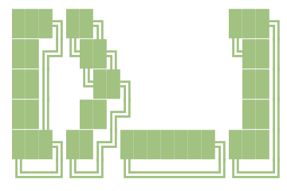

# Unix Shell Programming

</img>

This repository holds the material for the seminar on `Unix Shell Programming` organised by the Department of Industrial Engineering of the University of Trento. Use this material to follow along with the seminar and to practice the concepts discussed.

## Pre-requisites

- A Unix-like operating system (Linux, macOS, WSL on Windows).
- A terminal emulator (e.g., `bash`, `zsh`, `fish`). We will use `bash` in this seminar, but the concepts are applicable to other shells as well.
- A text editor (e.g., `vim`, `nano`, `gedit`, `sublime`, `vscode`). We will use `vim` in this seminar, but you can use any text editor you are comfortable with.
- Basic knowledge of the Unix command line. We will quickly review the basics, but it is recommended to have some prior experience with the Unix command line.
- Basic knowledge of programming concepts. We will quickly review the basics, but it is recommended to have some prior experience with programming.

## Timetable

We will divide the 8-hour seminar into four 2-hour sessions over the course of two days. The timetable is as follows:

- **27/06/2024**
  - 09:00 – 11:00: Introduction to Unix Shell Programming
  - 14:00 – 16:00: Unix Shell Programming: theory
- **28/06/2024**
  - 09:00 – 11:00, Unix Shell Programming: hands-on practice
  - 14:00 – 16:00: Exam

## Outline

The outline of the seminar is as follows:

1. **Introduction to Unix Shell Programming**
   - Introduction to Unix
   - Basic Unix Commands
   - Shell Scripting Basics
2. **Unix Shell Programming: theory**
   - Creating and running shell scripts
   - Variables
   - Arithmetic operations
   - Passing arguments to scripts
   - Arrays
   - Conditional statements
   - Loops
   - Functions
3. **Unix Shell Programming: hands-on practice**
   - A practical file organizer
4. **Exam**
   - The exam will consist of 30 multiple-choice questions that you will have to answer in 60 minutes. The questions will be based on the following sessions:
     - Introduction to Unix Shell Programming
     - Unix Shell Programming: theory

## Resources

Many resources are available online to learn Unix shell programming. Here are a few to get you started:

- [Getting Started With Linux Terminal](https://itsfoss.com/linux-terminal-basics/)
- [Start Learning Bash](https://linuxhandbook.com/bash/)
- [The Shell Scripting Tutorial](https://www.shellscript.sh)
- [Shell Programming Tutorial](https://www.learnshell.org)

## Let's Get Started

Without further ado, let's dive into the world of Unix shell programming! [Click here to get started](./lectures/00_introduction_to_unix_shell_programming.md).
